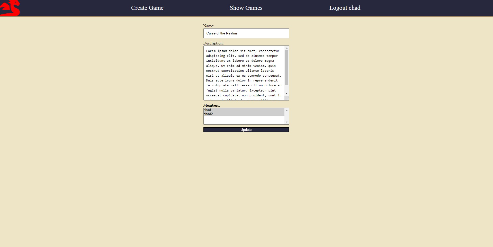

# Impetus

A minimalistic website to help keep track of the more narrative aspects of a tabletop rpg character, such as goals the character wants to complete during their adventure.

# Technologies Used

**Setup and Configuration**: Git, Pypi  
**Back-end Development**: Python, Django  
**Front-end Development**: HTML, CSS

# Building and running the project

In your terminal, clone down the repository.  
`git clone <clone url here>`

Once the project is cloned down, cd into the project directory that you just made, and activate a python virtual environment.  
`python -m venv .venv`
`source .venv/bin/activate`

Update pip once you have activated the virtual environment.  
`python -m pip install --upgrade pip`

Install the requirements for the project.  
`pip install -r requirements.txt`

Run the Django migrations.  
`python manage.py migrate`

Run the server.  
`python manage.py runserver`

Create a super user if you want to access the Django admin page for the site.  
`python manage.py createsuperuser`

Access the site through the browser.  
`http://localhost:8000`

# Visuals of how the site works

## Login and Homepage
The homepage has the option to allow you to delete any games that you have created.
 

## Game and Character Creation Pages
The game creation page allows you to put a title, a description, and add players to your game, so that the game shows up on their list of games.
The character creation page allows you to choose a name, write a description, and chose a class for that character.
 

## Game and Character Detail Pages
The game detail page lists out the details for the game, and shows the characters that are involved in the game. If you click on your character, you go to the detail page for your charcter. This allows you to add goals for your character and also mark them as complete.
 

